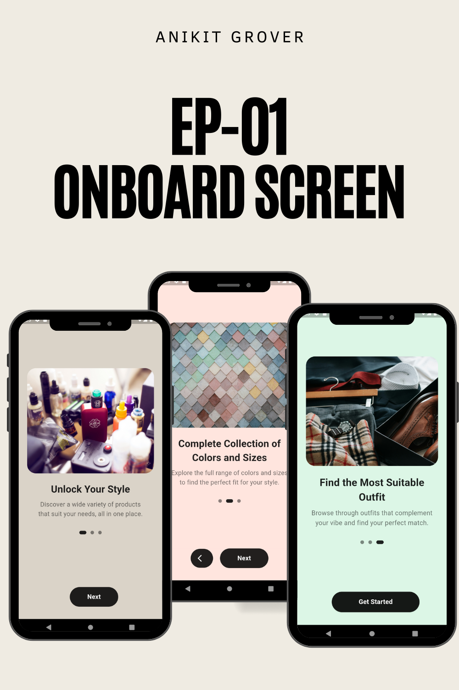

## Overview

Welcome to the eCommerce app project built with Flutter! A key feature of this app is the **onboarding screen**, designed to provide users with a smooth and informative introduction to the app.

## Onboarding Screen Features

- **Interactive Design:** Engaging walkthroughs to familiarize users with the app’s main functionalities.
- **Visual Appeal:** Thoughtfully designed graphics and animations that enhance user engagement.
- **User-Friendly:** Focused on ensuring a positive first-time user experience, which is critical for retention.

## Features

- **User-Friendly Onboarding:** A seamless introduction that enhances user retention and sets the tone for a delightful shopping experience.
- **Responsive Design:** Perfectly adapts to various device sizes, ensuring a smooth experience for all users.
- **Integration with Payment APIs:** Secure payment processing for a hassle-free shopping experience.
- **Beautiful UI/UX:** Modern design principles to create an appealing and intuitive interface.

### 📸 **App Screenshots:**

